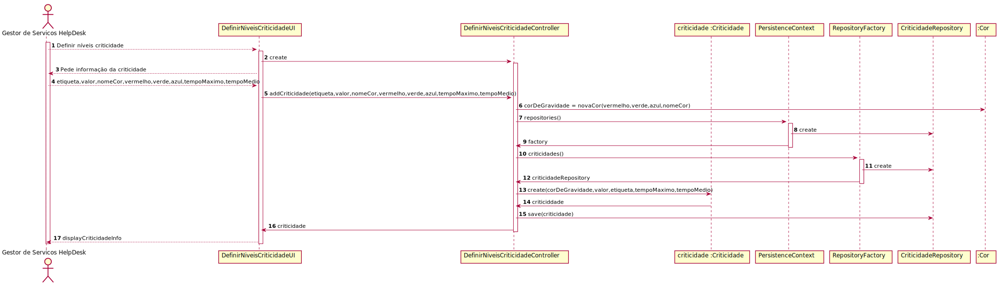

# UC4.1.8 -   User Story 2010

#1.Requisitos

Verificar que apenas o Gestor Serviços Helpdesk pode criar um novo nível de criticidade.

#2.Análise

O GSH pretende criar um novo nível de criticidade. Deve inserir a cor de gravidade, o valor, etiqueta, tempo máximo, tempo médio. Após isto é mostrada a informação que foi inserida. Tanto a cor de gravidade como o valor e a etiqueta devem ser únicos no sistema.

#3.Design

Foi criado o controlador DefinirNiveisCriticidadeController usando o padrão Controller, responsável pelo processo de criação do nivel de criticidade. Este controlador por sua vez faz uso da classe Criticidade para criar uma instância criticidade. Para persistir esta informação no sistema é usada o padrão Repository. O controlador usa CriticidadeRepository para guardar informação em base de dados.

#4.Testes

* A criticidade tem de ter cor única.   
* A criticidade tem de ter  um valor único.
* O valor da criticidade não pode ser nulo.
* A criticidade tem de ter uma etiqueta única.
* A etiqueta da criticidade não pode ser nula.
* Tempo médio não pode ser nulo.
* Tempo máximo não pode ser nulo.

###	Diagrama de Sequência

