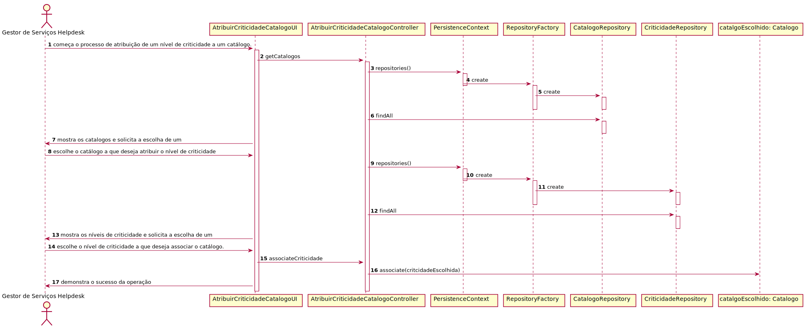

# UC4.1.9 -   User Story 2012

#1.Requisitos

Verificar que apenas o Gestor Serviços Helpdesk pode atribuir nível de criticidade a catálogo.

#2.Análise

O GSH pretende atribuir o nível de criticidade a um catálogo. Para isto deve escolher o catálogo a que quer atribuir o nível de criticidade e depois escolher o nível de criticidade que vai atribuir ao catálogo.

#3.Design

Foi criado o controlador AtribuirCriticidadeCatalogoController usando o padrão Controller, responsável pela atribuição do nível de criticidade ao catálogo. Este controlador por sua vez faz uso da classe Catálogo para atribuir uma instância criticidade a uma instância catálogo. Para persistir esta informação no sistema é usada o padrão Repository. O controlador usa ColaboradorRepository para guardar informação em base de dados.

#4.Testes

* O nível de criticidade tem de estar no sistema.   
* O colaborador tem de estar no sistema.   

###	Diagrama de Sequência

