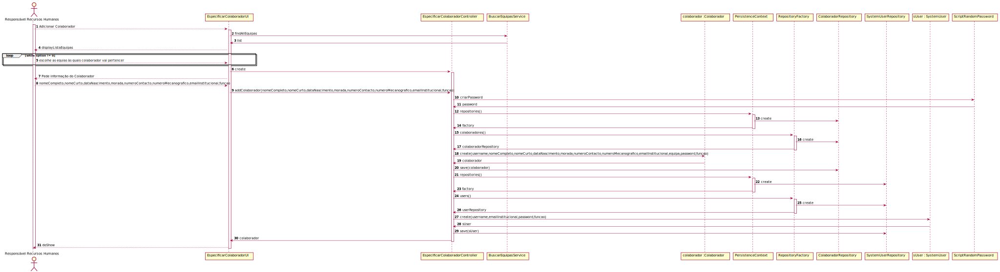

# UC4.1.4 -   User Story 2051

#1.Requisitos
Verificação que apenas o Responsável pelos Recursos Humanos pode registar um novo colaborador (verificação da função do utilizador).

#2.Análise
O RRH pretende especificar um novo colaborador.
Deve primeiro escolher a que equipas irá o colaborador pertencer.
 Após a escolha deve inserir o nome completo, nome curto, data de nascimento, morada, numero de contacto, numero mecanográfico, email institucional.
Após isto vai ser gerada uma password que será só do conhecimento do colaborador.
Tanto o número mecanográfico como o email institucional devem cumprir as regras do negócio, isto é ser únicos no sistema.

#3.Design

Foi criado o controlador EspecificarColaboradorController usando o padrão Controller, responsável pelo processo de criação do colaborador.
Este controlador por sua vez faz uso da classe Colaborador para criar uma instância de colaborador.
Para persistir esta informação no sistema é usado o padrão Repository. O controlador usa ColaboradorRepository para guardar a informação em base de dados.

#4.Testes

* O colaborador tem que ter um numero mecanográfico de departamento único
* O numero mecanográfico não pode ser vazio nem conter espaço(s).
*
* O colaborador tem que ter um email institucional único.
*  O numero mecanográfico não pode ser vazio nem conter espaço(s) e tem um "@" e um ".com" ou ".pt".

###	Diagrama de Sequência

