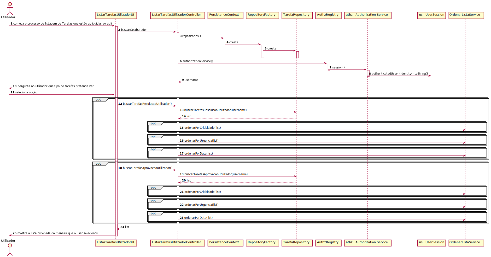

# UC4.1.9 -   User Story 3021

#1.Requisitos

Verificar que só o utilizador e quem tenha permissões é que pode verificar as tarefas pendentes atribuidas ao utilizador.

#2.Análise

O utilizador pretende verificar que tarefas lhe estão atribuídas. Para isto deve iniciar sessão e depois selecionar uma opção que permite verificar as suas tarefas, selecionar também o tipo de tarefas que quer verificar, se são de resolução ou de aprovação.

#3.Design

Foi criado o controlador ListarTarefasUtilizadorController usando o padrão Controller, responsável listagem das tarefas atribuidas ao utilizador. Este controlador por sua vez  vai ao TarefaRepository buscar as tarefas cujo colaborador responsável seja o colaborador com sessão iniciada. Para persistir esta informação no sistema é usada o padrão Repository.

#4.Testes

* O utilizador tem de estar registado no sistema.   
* O colaborador tem de estar no sistema.   
* O número de tarefas que o colaborador tem não pode ser 0.

###	Diagrama de Sequência

