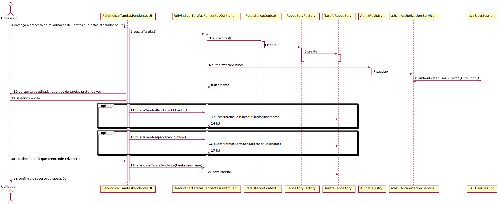

# UC4.2.6b-7 -   User Story 3022

#1.Requisitos

Verificar que o utilizador só tem acesso às tarefas pendentes da equipa que podem ser reivindicadas para mim, e caso o deseja, concretizar a reivindicação.

#2.Análise

O utilizador pretende verificar que tarefas pendentes não estão atribuídas ainda a alguém, e caso deseje atribui-las a si próprio . Para isto deve iniciar sessão e depois selecionar uma opção que permite verificar tarefas pendentes ainda não atribuídas. Caso deseje reivindicar alguma para si tem de selecionar qual deseja reivindicar.

#3.Design

Foi criado o controlador ReivindicarTarefasPendentesController usando o padrão Controller, responsável listagem das tarefas ainda não atribuídas a algum utilizador. Este controlador por sua vez faz uso da classe Tarefa, caso o utilizador deseje reivindicar uma das tarefas para si, o colaborador responsável da tarefa será o colaborador que tem a sessão iniciada. Para persistir esta informação no sistema é usada o padrão Repository. O controlador usa TarefaRepository para guardar informação em base de dados.

#4.Testes

* O utilizador tem de estar registado no sistema.   
* O colaborador tem de estar no sistema.   
* As tarefas não podem estar associadas a algum colaborador.

###	Diagrama de Sequência

